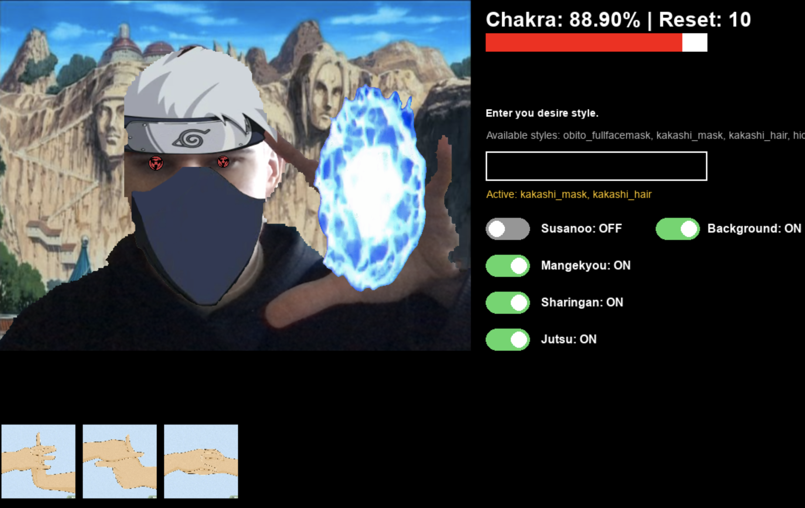
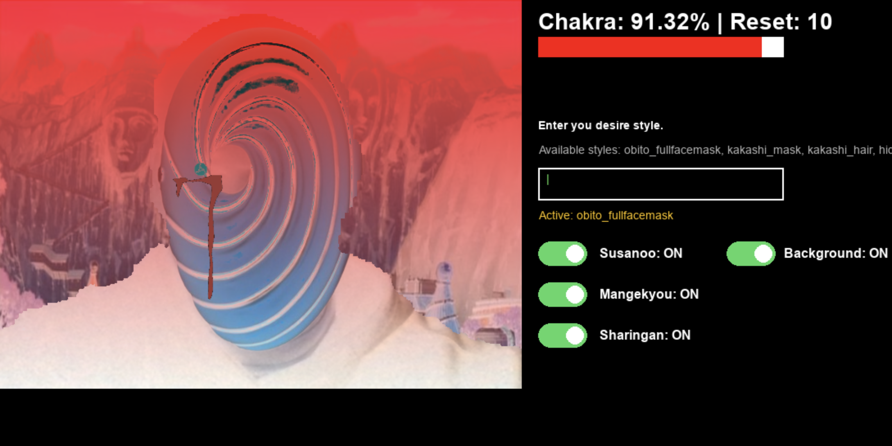

# 🍥 NarutoAR: Real-Time Computer Vision Jutsu Simulator

**NarutoAR** is an interactive Augmented Reality (AR) application that brings the world of Naruto into real life using your webcam. Recently upgraded from a terminal-based script to a fully interactive **Pygame GUI**, this project leverages advanced computer vision models (YOLO, MediaPipe, OpenCV) to detect real-time hand signs, trigger ninjutsu, and overlay complex Dojutsu (eye techniques) and character styles onto your face. 

Experience the thrill of weaving signs to cast *Chidori*, equipping iconic ninja gear, or awakening the *Mangekyou Sharingan*—but keep an eye on your Chakra reserves and beware of the Mangekyou's blindness penalty!

---

| Chidori | Sharingan |
|:---:|:---:|
|  |  |

---

## ✨ What's New? (Pygame Update)
* 🎮 **Interactive Pygame UI**: Say goodbye to terminal prompts! Control everything through an intuitive on-screen heads-up display (HUD) featuring clickable toggles, real-time chakra bars, and a hand-sign history tracker.
* 🎭 **Real-Time Style Picker**: Customize your look on the fly! Type your desired styles into the UI text box to equip items like `hidden_leaf_headband`, `kakashi_mask`, `kakashi_hair`, or `obito_fullfacemask` directly onto your face.
* 🏞️ **Dynamic Random Backgrounds**: Seamlessly replace your room with iconic Naruto locations (like the Hokage Monument) using background segmentation. Backgrounds are picked up randomly to keep the environment fresh.
* 👁 **The Three Great Dōjutsu**: The last two of the three great dōjutsu—the *Rinnegan* and the *Byakugan*—have been added. The *Rinnegan* now includes the “Chibaku Tensei” technique, one of the *Six Paths Techniques*, while the *Byakugan* now has the ability to see chakra flow.

---

## 🌟 Core Features

### 👐 Hand Sign Detection & Ninjutsu
* **YOLO-Powered Sign Tracking**: Weave hand signs (e.g., Tiger, Snake, Dragon) in front of your camera. The app tracks your sequence in real time and displays your history at the bottom of the screen.
* **Hand-Based Jutsus**: Trigger abilities like *Chidori* or *Rasengan* that dynamically scale and track the position of your hands.
* **Environmental Manipulations**: Perform *Water Prison Jutsu* with real-time OpenCV screen distortion or use *Death Reaper* effects.

### 👁️ Dojutsu & Transformations
* **Sharingan Tracking**: MediaPipe Holistic dynamically maps Sharingan overlays onto your pupils, automatically scaling and hiding them when you blink or close your eyes.
* **Mangekyou Abilities**:
  * 🔥 **Amaterasu**: Summons black flames with eye-bleeding effects.
  * 🌑 **Tsukuyomi**: Inverts colors, tints the world red, and distorts time.
  * 🌀 **Kamui**: Click anywhere on the screen to create a spatial distortion/suction vortex.
  * 🦴 **Susanoo**: Overlays a scaled Susanoo ribcage/avatar based on your shoulder and head proportions.
  * 🧠 **Kotoamatsukami**: An emerald-green tint washes over the screen, featuring images of falling raven 
  feathers with blurred, indistinct edges.
  * ⚫️ **Ohirume**: Click anywhere on the screen to create four black spheres of any radius.

### 📊 RPG Mechanics
* **Chakra System**: A visual health-bar style Chakra meter tracks your energy. Active Jutsus and Dojutsu drain your Chakra. If you run out, techniques deactivate until you reset.
* **Blindness Accumulator**: Overusing Mangekyou techniques incrementally builds blindness (Light ➔ Medium ➔ Heavy), obscuring your camera feed.
* **Player Profiles**: Saves your current Chakra level, available resets, and blindness state across sessions.

---

## 🛠️ Prerequisites & Dependencies

To run this project, you will need **Python 3.10.16+** and a webcam.

**Required Assets (Not included in code):**
Since this project relies on custom assets, ensure you maintain the appropriate directory structures for your media:
* `src/assets/three_great_dojutsu/sharingan/mangekyou/techniques/amaterasu.gif`
* `src/assets/three_great_dojutsu/sharingan/mangekyou/techniques/susanoo.png`
* Custom trained YOLO model for hand signs (`YOLO_MODEL_PATH`).
* GIF/PNG files for Jutsus, backgrounds, and Styles defined in your catalogs.

---

## 🚀 Installation & Usage

1. **Clone the repository**:
   ```bash
   git clone https://github.com/ioscbasotcstw/NarutoAR.git
   cd NarutoAR
   ```
2. **You know you need to create a virtual environment and activate it, right?**:
   For MacOS/Linux
   ```bash
   python3.10 -m venv .venv
   source .venv/bin/activate
   ```
   For Windows
   ```bash
   python -m venv .venv OR py -3.10 -m venv .venv
   .venv\Scripts\activate
   ```
3. **Install the required Python packages**:
   ```bash
   pip install -r requirements.txt
   ```
4. **Add API Key**: Create a `.env` file containing your Google GenAI API key, example `GEMINI_API_KEY="your-api-key"`

5. **Run the Application**:
   ```bash
   python3 -m src.naruto_pygame.naruto_ar_pygame
   ```
6. **In-Game Flow**:
   * Once the Pygame window opens, your webcam feed will initialize alongside the HUD.
   * **Style Picker**: Click the text box (`Enter you desire style`) and type in styles (e.g., `kakashi_mask`, `kakashi_hair`). Press Enter to apply them.
   * **Six Paths Technique**: Click on the text field (“Enter the desired technique”) and type the name of the available technique. Press Enter to apply.
   * **Toggles**: Use the on-screen switches to instantly activate or deactivate **Susanoo**, **Backgrounds**, **Mangekyou**, **Sharingan**, **Byakugan** and **Jutsu**.
   * Perform hand signs in front of the camera to trigger your configured jutsu sequences.

---

## 🎮 Controls & Configuration

* **Pygame UI Toggles**: Click the green/grey switches on the right panel to manage active states (Sharingan, Mangekyou, Background, Susanoo, Jutsu, Byakugan).
* **Style Input Box**: Type your desired cosmetics directly into the UI.
* **Six Paths Technique Input Box**: Type your desired technique.
* **Left Mouse Click**: Sets the center point for the **Kamui** vortex and toggles it ON/OFF. This also applies to **Chibaku Tensei**.
* **`r` Key**: Resets your hand sign history and deactivates the current Jutsu.
* **`q` Key / Esc**: Quits the application and saves your current Chakra/Blindness progress.
* **`TAB` Key**: Press the Tab key *once* to highlight the style selection field, and then press the Tab key *twice* to highlight the “Six Paths Technique” field.
* **`user_info.naruto` File**: Used for deep configuration of your Dojutsu profile. 
  * *Format example:* `Kakashi. mangekyou. indra. amaterasu, tsukuyomi, susanoo, kamui, kotoamatsukami.`
  * *Structure:* `[Username]. [Sharingan Stage (Tomoe 1-3 or Mangekyou)]. [Mangekyou Owner].[Techniques].` 
  * Edit this file to change your user profile, level up your Sharingan, swap Mangekyou owners, or learn new techniques.

---

## 🏗️ Architecture

* **`NarutoAR` (Main Pygame Loop)**: Manages the Pygame display surface, UI event handling, webcam frame acquisition, and layered rendering of AR elements.
* **`JutsuFactory`**: Orchestrates standard Jutsu rendering. Switches between OpenCV base effects, background segmentations, and hand-bound GIFs.
* **`DojutsuFactory`**: Processes MediaPipe Face/Pose landmarks to precisely map Sharingan, Rinnegan and Byakugan eyes and render complex Mangekyou abilities based on eye-open states.
* **`TechniqueInterface`**: The base class guaranteeing an `apply()` method for modular integration of new techniques like `KamuiEffect` or `SusanooEffect`.

---

## 🙏 Special thanks

* To `tysuprawee` for his wonderful [Naruto-Hand-Signs](https://github.com/tysuprawee/Naruto-Hand-Signs) project, which inspired me to create my own project.
* To `@otani-sbz1y` for his [dataset](https://universe.roboflow.com/otani-sbz1y/naruto-in)

---

## ⚠️ Disclaimer
This is a fan-made, non-commercial open-source project. *Naruto*, *Sharingan*, and all related properties are trademarks of Masashi Kishimoto, Shueisha, and VIZ Media. This project is for educational purposes in computer vision and Python programming.
